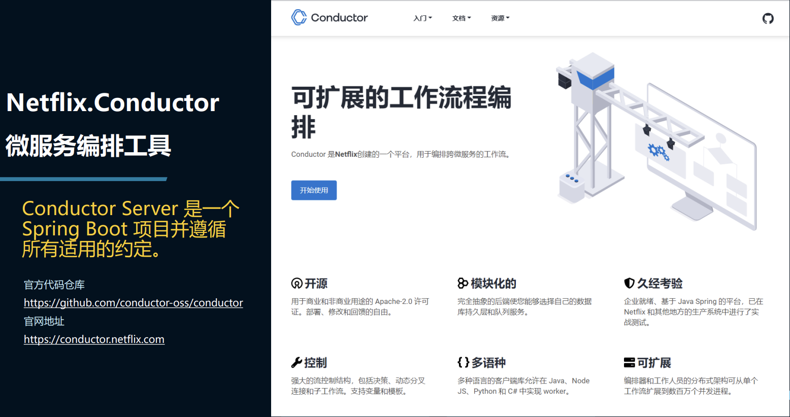
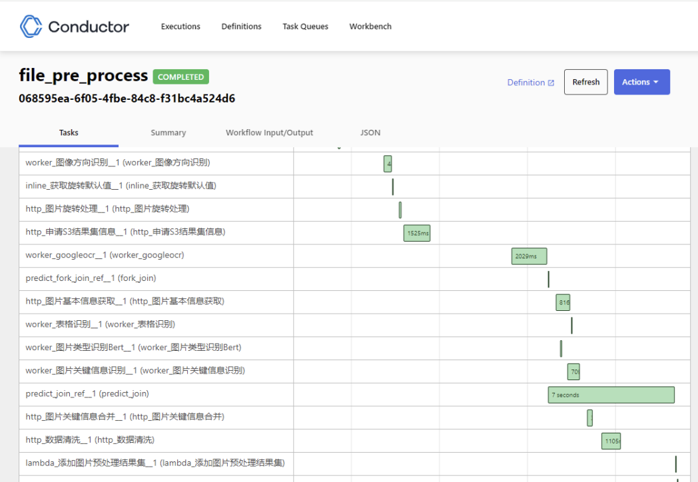
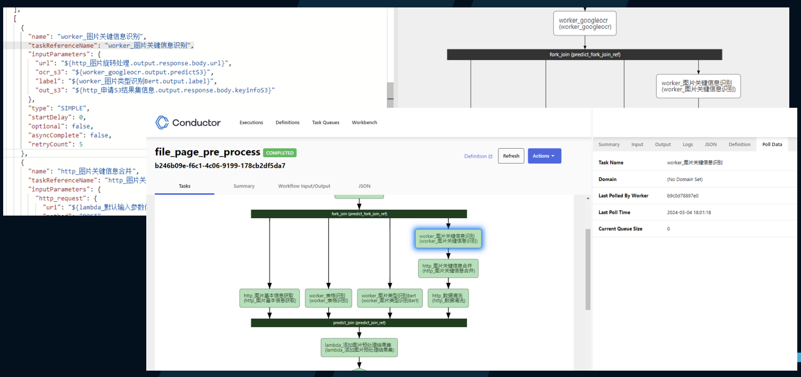

# docflow

文档处理服务 - 文档数据结构化提取

## 服务依赖

* postgres
* minio
* elasticsearch
* conductor

### 微服务集成方式

本项目主要使用**Netflix Conductor**作为主要核心工具，串联各个微服务，达到对于各个AI推理过程的监控、评估模型推理情况。

微服务编排AI模型具有以下优势：

1. **灵活性和可扩展性**：微服务架构允许将AI模型拆分为较小的服务单元，这些单元可以独立部署、扩展和更新。这种灵活性使得系统更容易扩展，同时也更容易适应变化。

2. **高可用性和容错性**：微服务架构可以提高系统的可用性，因为即使一个服务出现故障，其他服务仍然可以继续运行。这种容错性有助于确保AI模型的持续可用性。

3. **技术异构性**：微服务架构使得不同技术栈的服务可以共存，这意味着可以选择最适合特定任务的技术来实现AI模型的不同部分。

4. **快速部署和更新**：微服务架构可以实现快速部署和更新，因为每个服务可以独立部署，而不会影响整个系统。这有助于快速推出新功能和修复bug。

5. **资源利用效率**：微服务架构可以根据需求动态分配资源，从而提高资源利用效率。这对于处理大规模的AI工作负载尤为重要。

6. **易于维护和监控**：由于微服务架构将系统拆分为较小的服务单元，因此更容易定位和解决问题。此外，可以针对每个服务单独设置监控和日志记录，有助于实时监控系统的性能和健康状况。

7. **业务敏捷性**：微服务架构使团队能够更快地响应业务需求，因为他们可以独立开发、测试和部署服务。这有助于提高业务的敏捷性和创新能力。

综上所述，微服务编排AI模型具有灵活性、可扩展性、高可用性、快速部署和更新、资源利用效率、易于维护和监控以及业务敏捷性等诸多优势，使其成为构建复杂AI系统的理想选择。

